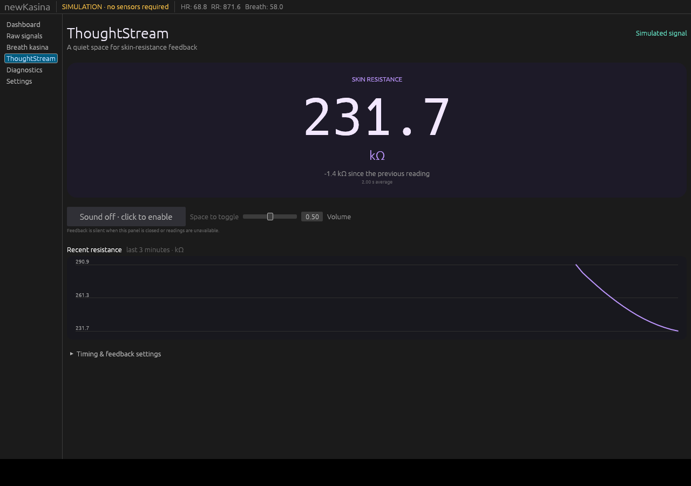

# ThoughtStream panel validation — 2026-09-10

Implemented in the native Rust app, consuming the existing service streams.
The original Python `tts2` code and its three WAV files were used as the reference.

- App and audio unit tests: 30 passed. Tests cover the original adaptive cadence,
  strict warning threshold, reference updates and warning/timer interaction;
  configurable intervals; averaging; retained-history exclusion; stale and invalid
  readings; gaps and session changes; mute-on-leave; Space autorepeat and text-edit
  handling; old settings migration; preference bounds and serialization; WAV decoding.
- Opt-in desktop audio test: all three embedded sounds played through the default
  output without a backend error (`output_tests::plays_original_cues_on_default_output`).
- Native GUI exercised on an isolated Xvfb desktop using X11 mouse and keyboard
  events and local simulation. Checked the panel, timing controls, button-to-Space
  muting, and restored preferences after restarting the release app. The test profile
  changed averaging from 1 to 2 seconds; the user's settings were not changed.
- PipeWire exposed one `alsa_playback.kasina-app` stream while enabled and zero after
  Space mute. Other applications' audio streams were left alone.
- Workspace Clippy with all targets/features and warnings denied passed. Release
  app rebuilt for the existing desktop launcher.

The GUI run used simulated signals. The acquisition driver was unchanged; its
previous physical-device validation is recorded in `2026-09-10-thoughtstream.md`.
Interactive test artifacts and logs are under `/tmp/newkasina-feedback-preview`;
selected screenshots accompany this note.

