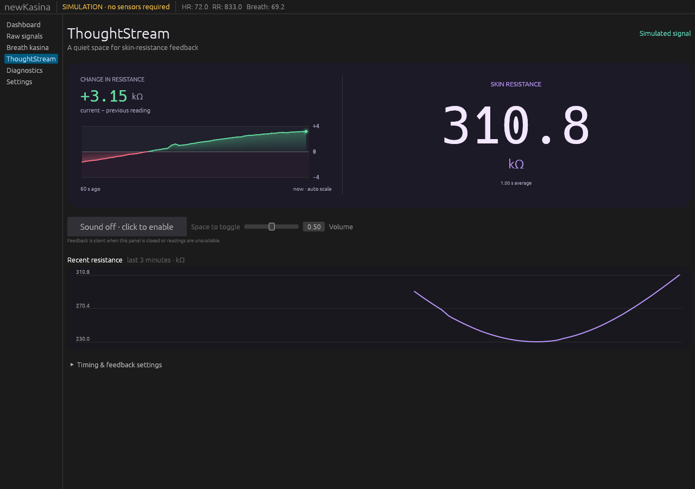

# ThoughtStream delta display — 2026-09-16

Added a delta chart to the left of the main resistance readout. The signed numeric
value uses two decimal places in kΩ and compares consecutive displayed averages.
The 60-second trace has a fixed zero centre, symmetric labeled automatic bounds,
green shading above zero, red shading below zero, and a hover readout with age.
Line segments crossing zero are split at zero before shading. Missing readings
break the trace and require a fresh pair of averages before showing another delta.
Audio rules and cue visibility were not changed.

Validation:

- 31 app tests passed, including new consecutive-average/gap handling and signed
  formatting cases.
- Clippy for all app targets with warnings denied and formatting checks passed.
- Release app rebuilt for the desktop launcher.
- Isolated Xvfb/native GUI with local simulation: checked 1280 × 900 and 800 × 650
  layouts, negative and positive deltas, zero crossing, and historical hover values.
  The real service and user settings were not modified.

