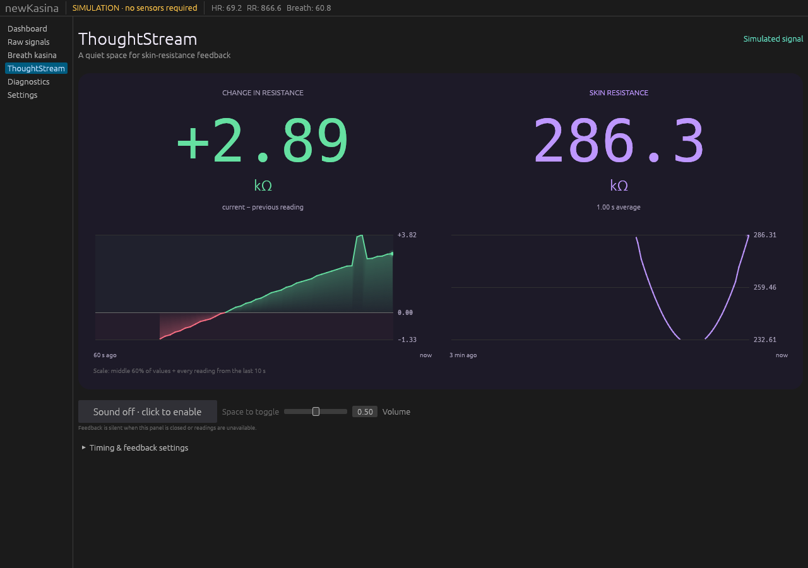

# ThoughtStream two-by-two layout and robust scaling

The upper row shows delta and absolute resistance with a shared large font size.
The lower row contains their graphs in equal-width columns. There are no cell
borders or dividing lines. Delta remains signed/colour-coded and both charts offer
numeric hover readouts.

Both plots use interpolated 20th–80th percentile bounds for their visible history,
expanded to include every finite reading aged at most 10 seconds. Delta uses the
same bound rule as absolute resistance, without imposing symmetry or including
zero when it is outside the resulting range. Older points outside those bounds
break the trace; they are neither clamped nor connected across. Retained values,
recordings, big numbers and audio rules are unchanged.

Validation: 35 app tests passed, including old extreme rejection, recent extremes
on both sides, the exact 10-second boundary, expiry after 10 seconds, and finite
ranges for flat, empty and invalid histories. App Clippy with warnings denied and
format checks passed. Release app rebuilt for the desktop launcher. Native GUI
checks use an isolated Xvfb display and a simulation-only test profile.

Inspected 1280 × 900 and 800 × 650 layouts and numeric hover readouts.

