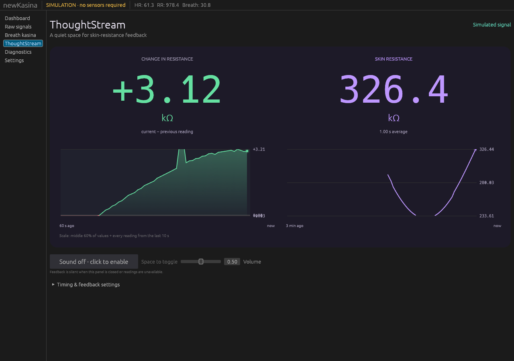

# ThoughtStream delta shading correction

The fill now uses a single gradient defined by vertical position in the plot.
Each segment is clipped geometrically before assigning its vertex colours, so
slopes and off-scale endpoints cannot stretch or change the gradient. Delta
outliers still do not expand the percentile bounds, but their filled segments
continue to the visible edges. One sample preceding the visible window is retained
for rendering its boundary-crossing segment, without contributing to bounds or
hover values. Actual missing/invalid readings continue to break the trace.

Verification: 39 app tests passed, including mesh coverage above and below the
plot, the left-boundary intersection, shared gradient colours, and preserved gaps.
App Clippy with warnings denied and formatting checks passed. Release app rebuilt.

Native GUI inspected with an isolated simulation profile: confirmed consistent
fill through an off-scale spike and continuity at the left edge after a full
60-second window. The live measurement service was not modified.

