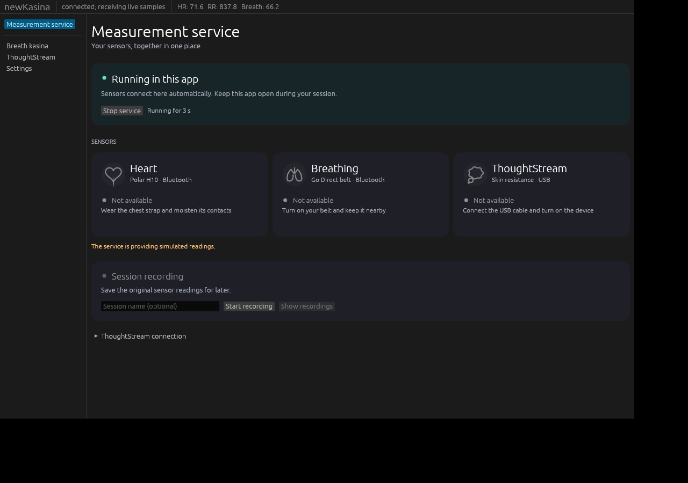

# Integrated measurement service and desktop packaging

## Local validation

- Workspace formatting, strict Clippy, and the full test suite pass on Linux.
- Runtime tests cover authenticated sensor pause/resume, independent sensor
  control, serial preference persistence, lock/port conflicts before acquisition,
  shutdown with active subscriptions, and finalizing recordings before ownership
  is released.
- Host tests confirm that an attached app cannot stop an existing service, while
  an app-owned service stops cleanly and can restart with a new instance ID.
- Linux tray control tests cover a second launch forwarding Start to the original
  tray, startup races, stale-socket recovery, private endpoint permissions, and
  rejection of unsupported commands.
- A packaged release app launched under Xvfb, rendered 203 frames, and received
  47 samples from its own isolated simulated service before closing successfully.
  See [the smoke report](measurement-service-smoke-linux-2026-09-25.json).
- The actual integrated window was visually checked at 1180 x 780; separate panel
  fixtures were also checked at desktop and compact window sizes.

The screenshot uses simulated acquisition. Physical sensors therefore remain gray;
their cards do not misrepresent simulated samples as connected hardware.

## Native CI requirements

The workflow builds, tests, packages, and launches the packaged GUI with an
isolated simulated service on Linux, Windows x64, macOS Apple Silicon, and macOS
Intel. Packaging verifies macOS bundle metadata, system-library dependencies,
architecture, deployment target, signature, and disk-image integrity. Windows
packaging rejects executables requiring a separate Visual C++ redistributable.

Successful GUI smoke reports require rendered frames and samples from the exact
embedded service instance. A compile-only result is not treated as a passing GUI
check. Native run results are available in the repository's GitHub Actions page.

## Remaining manual checks

Real Mac hardware is still required to validate Bluetooth authorization, actual
sensor acquisition, USB adapter drivers, and first launch of a downloaded,
quarantined app. The Mac builds are ad-hoc signed, not Apple notarized; the
[Mac guide](../macos.md) explains the first-open permission and installation.
